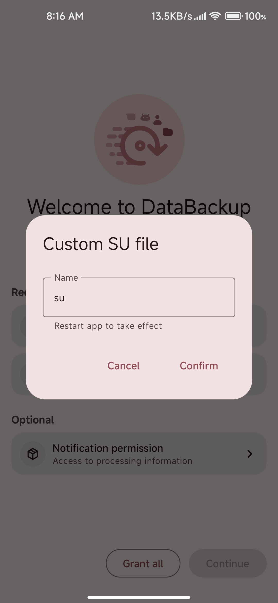

# Setup

## Root permission
You need to grant root first.

### * Magisk
You can grant root access directly in the popup window when clicking the permission card.

### * KernelSU/APatch
You need to grant root access manually in their manager first, then restart **DataBackup**.

### Custom su file
For some devices, `su` file may not be named `su`, so you can edit it manually. Just remember to restart **DataBackup** to make it work.
