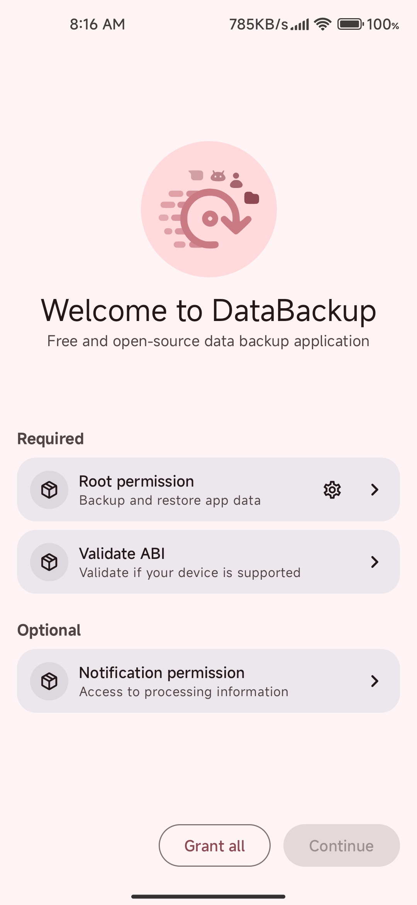
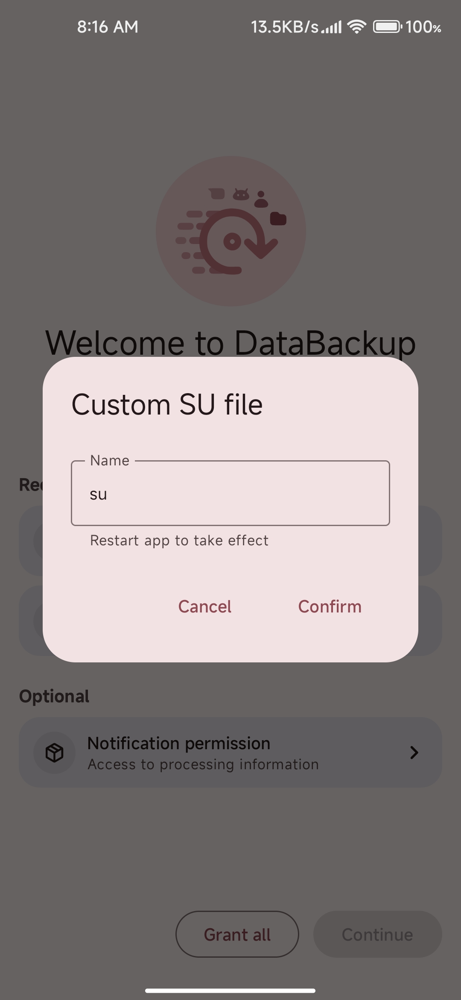

# 引导

    

## Root权限
首先你需要授予Root权限。

### * Magisk
当点击权限卡片时，你可以直接在弹出的窗口中授予Root权限。

### * KernelSU/APatch
你首先需要在它们对应的管理器中手动授予**数据备份**权限，然后重启**数据备份**。

### 自定义SU文件
对于某些设备来说，`su`可能并非以`su`命名，所以你可以手动编辑。只需记住编辑完成后需要重启**数据备份**以生效。

    

